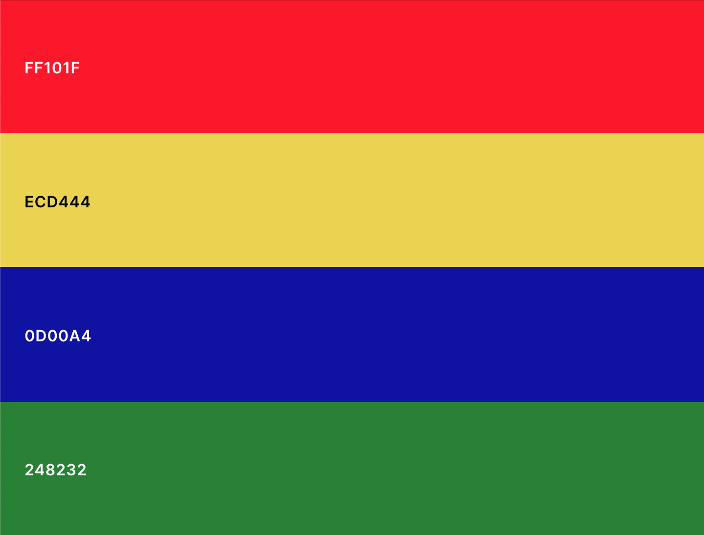

# Color Switcher

## Setup
As always...
1. Fork,
1. Clone,
1. Install dependencies,
1. Get hacking!

## Instructions

The finished app should switch the color of the `#color-panel` box to the color represented by each button, and change the color of the text to the value of the `input` color palette, such as [this](http://wrathful-rest.surge.sh/).

#### Part 1: Color Panel

1. Create a new variable in `this.state` called `color`, and assign its value to `"black"`.
1. Replace the `className` of the `#color-panel` div with the `color` variable from state.
1. Create a class method called `changeColor`, that takes a parameter `newColor`. This method should set the color in state to `newColor`, by using the `this.setState` method.
1. On the button with a `red` class, add an `onClick` event listener which calls the `this.changeColor` method with an argument of `red`.
1. Once the color panel changes to red, implement the same on each of the buttons, with their respective colors as the arguments for the `this.changeColor` function call.

#### Part 2: Text Color

1. Create a new variable in `this.state` called `textColor`, and assign its value to `"black"`.
1. Replace the `"black"` in the style object with the `textColor` variable from state.
1. Create a class method called `changeTextColor`, that takes a parameter `event`. This method should take the value of the target of the `event` and set the `textColor` in state to that value, using the `this.setState` method.
1. On the input element, add an `onChange` event listener which calls the `this.changeTextColor` method, with an argument of `event`. (Hint: Where can we get `event` from?)
